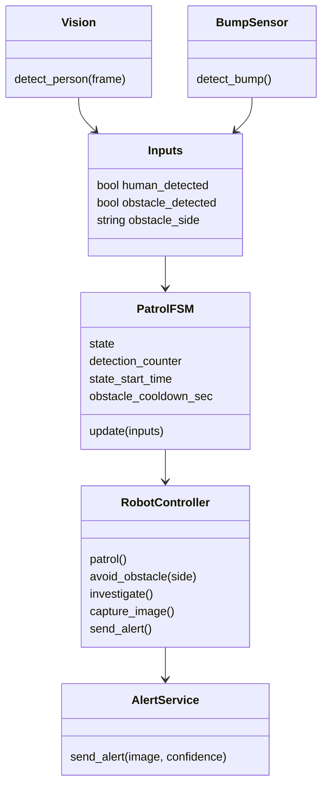
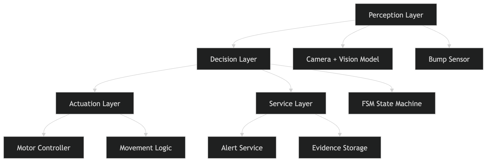

# Smart Patrol JetBot

Autonomous security patrol robot built on Jetson Nano using a modular system architecture and finite state machine (FSM) for real-time decision making.

## Overview

This project simulates and runs a patrol robot capable of:
- Navigating a predefined patrol path
- Detecting humans using computer vision (SSD Mobilenet v2)
- Avoiding obstacles using sensor fusion (vision + bump detection)
- Capturing evidence and sending real-time alerts via Telegram

The system is designed with a strong focus on **embedded systems architecture, modular design, and real-time control loops**.

## System Design

The architecture is divided into clear layers:

- **Perception Layer** — camera input, object detection, obstacle detection  
- **Decision Layer** — FSM-based state management and transitions  
- **Actuation Layer** — motor control and movement execution  
- **Services Layer** — alerting and external integrations  

This separation enables clean abstraction between hardware, logic, and external systems.

## Data Flow

## System Pipeline

## Key Features

- Real-time control loop (~10Hz hardware runtime)
- Sensor fusion (vision + bump detection)
- Obstacle avoidance with cooldown logic
- Simulation environment for testing without hardware
- Modular architecture supporting hardware abstraction
- External alerting via Telegram API

## Simulation Support

Includes a simulation runtime that generates synthetic sensor inputs, enabling:
- Faster iteration
- Debugging without hardware
- Validation of FSM logic

## Tech Stack

- Python
- Jetson Nano (JetBot)
- OpenCV + jetson-inference (SSD Mobilenet v2)
- Adafruit MotorHAT (I2C motor control)
- GPIO (sensor input)
- Telegram Bot API

## Architecture Diagrams

See diagrams above for:
- System architecture
- FSM state transitions
- Control flow

## Key Takeaways

- Designed a modular embedded system with clear separation of concerns  
- Implemented deterministic control logic using FSM architecture  
- Built a real-time system integrating perception, decision-making, and actuation  
- Developed both hardware and simulation runtimes for robustness  
